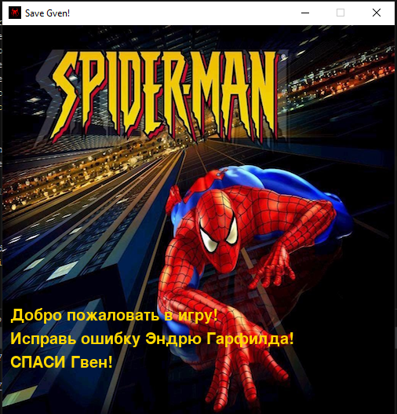

# SAVE GVEN!
Save Gven - игра для истинных фанатов человека-паука! Помоги Эндрю Гарфилду исправить его ошибку и поймай Гвен Стейси, но будь осторожен - Зелёный Гоблин тоже не дремлет и сбрасывает свои бомбы, чтобы лишить тебя жизни!
##### И помни:
> С большой силой приходит большая отвественность

___
### Техническое задание
Игра имеет следующие функции:
* Управление героем при помощи нажатия на клавиши
* Взаимодействие между спрайтами на экране
* Музыкальное сопровождение
* Сохранение результатов в result.txt
* Повышение сложности уровней
* Возможность ставить игру на паузу
* Изменение интерфейса во время игрового процесса
* Подсказки на начальном экране для новичков
___
### Пояснительная записка
#### Название проекта
* [Save Gven](https://docs.google.com/presentation/d/1Ok7_RgXz7E8WmAbKW1MqjsUXAseC8a-HoJasEFAeTIc/edit?usp=sharing)
#### Авторы проекта
* [Янский Павел](https://vk.com/pavelyanski)

#### Описание идеи
Моя игра представляет собой некоего рода тест на реакцию и сообразительность, представленный в стиле фильма "Невероятный Человек-Паук". Цель игрока - собрать как можно больше "падающих" Гвен[^1], сохранив при этом хотя бы одну жизнь, чтобы завершить игру со статусом победителя. Помимо Гвен на экране могут появляться различного рода "бонусы", например, дополнительные очки здоровья, бонусы, увеличивающие скорость вашего персонажа, а также бомбы, которые ни в коем случае нельзя ловить, потому что при соприкосновении с ними вы теряете одну единицу здоровья. Помимо этого в игре есть звуковое сопровождение, что позволяет  еще больше погрузиться в игровой процесс.

#### Принцип работы

Чтобы реализовать игру на __ЯП Python__ я подключил бибилиотеку pygame, предоставляющую огромные возможности для разработчиков игр. При помощи ЯП Python я создал классы, необходимые для создания игры: класс главного героя(__Spider__), класс для бонусов(__Bonus__), класс Гвен(__Gven__), класс уровня(__Level__), а также несколько вспомогательных классов для вывода информации на игровое окно. Основной функцией пратически всех классов являтеся функция update, которая заново отрисовывает спрайт на экране.
 Помимо классов, я создал функции, которые потвечают за следующие действия:
* Вывод стартового окна
* Вывод инструкции
* Вывод финального окна
* Запуск основного игрового цикла
* Запись результата в текстовый файл __results.txt__
* Определение максимального результата из файла __results.txt__
* Загрузка фотографии из директории __"data"__

Чтобы запустить игру на каком-либо устройстве необходимо установить библиотеку __pygame == 2.1.2__
### Скриншоты
#### Главное окно

#### Окно инструкции

#### Сама игра

#### Другой интерфейс

#### Окно проигрыша

#### Окно выигрыша

#### Окно паузы

[^1]: Героиня фильма "Новый Человек-паук" и "Невероятный Человек-паук", возлюбленная Питера Паркера - человека-паука.

